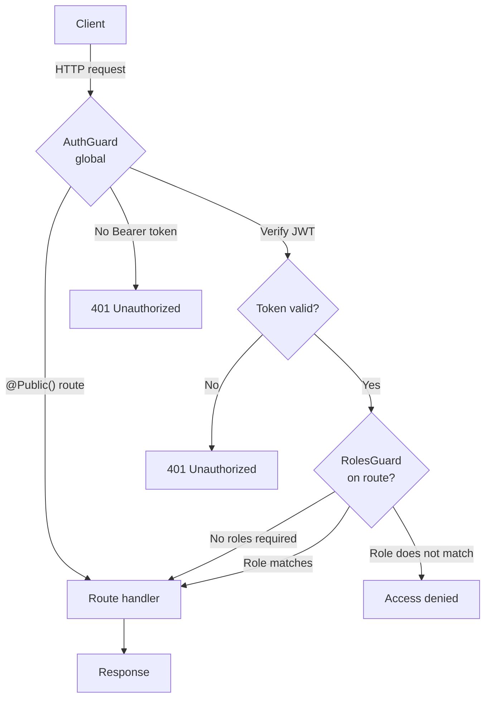
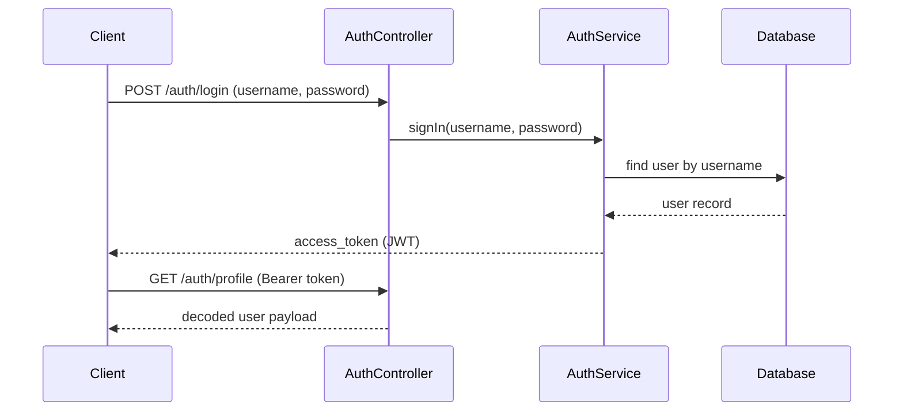

<div align="center">

# NestJS Authentication and Authorization


**A NestJS REST API example that shows JWT authentication and role based access control using guards, custom decorators, TypeORM, and PostgreSQL.**

</div>

> [!NOTE]
> This is a learning and demo project. It follows the official NestJS guides on
> [authentication](https://docs.nestjs.com/security/authentication) and
> [authorization](https://docs.nestjs.com/security/authorization). It is meant
> for study and as a starting point, not for production use as is. See the
> [Security notes](#security-notes) and [Roadmap](#roadmap) sections before
> using it.

## Table of Contents

- [About](#about)
- [Features](#features)
- [Tech Stack](#tech-stack)
- [Architecture](#architecture)
- [Getting Started](#getting-started)
- [API Reference](#api-reference)
- [Project Structure](#project-structure)
- [Configuration](#configuration)
- [Security notes](#security-notes)
- [Roadmap](#roadmap)
- [Contributing](#contributing)
- [License](#license)

## About

This project is a small NestJS API that demonstrates two related ideas:

1. **Authentication** with JSON Web Tokens. A user logs in with a username and
   password and receives a signed JWT. The token is then sent on later requests
   as a `Bearer` token.
2. **Authorization** with role based access control. Each user has a role
   (`user` or `admin`). A guard checks the role encoded in the JWT before it
   allows access to protected routes.

The token is signed and verified directly with the `@nestjs/jwt` package. This
project does not use Passport. A global `AuthGuard` protects every route by
default, and a `@Public()` decorator marks the routes that should stay open
(login and user signup). A separate `RolesGuard` plus a `@Roles()` decorator
enforce role requirements on specific routes.

## Features

- JWT authentication using `@nestjs/jwt` (no Passport).
- A global `AuthGuard` that protects all routes by default.
- A `@Public()` decorator to opt routes out of the global guard.
- Role based access control with a `RolesGuard` and a `@Roles()` decorator.
- Roles defined as a TypeScript enum (`user`, `admin`) and stored on the user.
- Request validation with `class-validator` DTOs.
- TypeORM with a PostgreSQL database and a `User` entity.
- Configuration through environment variables with `@nestjs/config`.

## Tech Stack

| Layer | Technology |
|-------|------------|
| Framework | NestJS 10 |
| Language | TypeScript 5 |
| Authentication | `@nestjs/jwt` (JSON Web Tokens) |
| Authorization | Custom guards and decorators (RBAC) |
| ORM | TypeORM 0.3 |
| Database | PostgreSQL (`pg` driver) |
| Validation | class-validator, class-transformer |
| Config | `@nestjs/config` |
| Testing | Jest, Supertest |

## Architecture

The diagram below shows how a request flows through the guards. The global
`AuthGuard` runs first and verifies the JWT, unless the route is marked
`@Public()`. Routes that also use the `RolesGuard` then check the user's role.



Login itself is a public route. The service checks the username and password,
then signs a JWT that carries the user id, username, and roles.



## Getting Started

### Prerequisites

- Node.js 18 or newer and npm.
- A running PostgreSQL database.

### Installation

```bash
git clone https://github.com/atiqbitstream/nestJs-authNauthorize.git
cd nestJs-authNauthorize
npm install
```

### Configuration

Create a `.env` file in the project root with your database settings. See the
[Configuration](#configuration) section for the full list of variables.

```bash
DB_HOST=localhost
DB_PORT=5432
DB_USERNAME=postgres
DB_PASSWORD=your_password
DB_DATABASE=authdemo
```

### Run

```bash
# development with file watching
npm run start:dev

# plain start
npm run start

# production build and run
npm run build
npm run start:prod
```

The API listens on `http://localhost:3000`.

TypeORM runs with `synchronize: true`, so the database tables are created
automatically from the entities on startup. This is convenient for local
development but should not be used in production.

### Tests

```bash
# unit tests
npm run test

# end to end tests
npm run test:e2e

# coverage
npm run test:cov
```

> [!NOTE]
> The unit and e2e tests are the default NestJS scaffold tests and are not yet
> customized for this project's logic.

## API Reference

All routes are protected by the global `AuthGuard` unless marked public. Send
the token as `Authorization: Bearer <access_token>`.

| Method | Route | Auth | Description |
|--------|-------|------|-------------|
| `POST` | `/users` | Public | Create a user. Body: `username`, `password`, `role`. |
| `POST` | `/auth/login` | Public | Log in and receive a JWT. Body: `username`, `password`. |
| `GET` | `/auth/profile` | Bearer token | Return the decoded JWT payload of the current user. |
| `POST` | `/auth/protected` | Bearer token, role `user` | Example route protected by the `RolesGuard`. |
| `GET` | `/users` | Bearer token | Stub. Returns a placeholder string (see Roadmap). |
| `PATCH` | `/users/:id` | Bearer token | Stub. Returns a placeholder string (see Roadmap). |
| `DELETE` | `/users/:id` | Bearer token | Stub. Returns a placeholder string (see Roadmap). |

Example login request:

```bash
curl -X POST http://localhost:3000/auth/login \
  -H "Content-Type: application/json" \
  -d '{"username": "alice", "password": "secret"}'
```

The login response is a JSON object with the token:

```json
{ "access_token": "<jwt>" }
```

> [!NOTE]
> The signed JWT expires after 60 seconds by default. You can change this in
> `src/auth/auth.module.ts` (`signOptions.expiresIn`).

## Project Structure

```text
src/
  app.module.ts          Root module, wires TypeORM and config
  main.ts                Bootstrap, listens on port 3000
  public.decorator.ts    @Public() decorator and metadata key
  auth/
    auth.controller.ts   login, profile, and a protected route
    auth.service.ts      Validates credentials and signs the JWT
    auth.guard.ts        Global guard that verifies the JWT
    auth.module.ts       Registers JwtModule and the global AuthGuard
    constants.ts         JWT secret placeholder (replace it)
    roles.guard.ts       Checks the user's role against required roles
    roles.decorator.ts   @Roles() decorator
    roles.enum.ts        Role enum (user, admin)
    dto/signIn.dto.ts    Login request validation
  users/
    users.controller.ts  Create user and CRUD stubs
    users.service.ts     User lookup and create with TypeORM
    users.module.ts      Users module
    entities/user.entity.ts  User entity with role column
    dto/                 Create and update user DTOs
```

## Configuration

The app reads these environment variables through `@nestjs/config`. Define them
in a `.env` file at the project root.

| Variable | Description | Example |
|----------|-------------|---------|
| `DB_HOST` | PostgreSQL host | `localhost` |
| `DB_PORT` | PostgreSQL port | `5432` |
| `DB_USERNAME` | Database user | `postgres` |
| `DB_PASSWORD` | Database password | `your_password` |
| `DB_DATABASE` | Database name | `authdemo` |

The JWT signing secret is set in `src/auth/constants.ts`. It currently holds the
placeholder value from the NestJS docs. Replace it with a strong secret and move
it out of source control before any real use. See [Security notes](#security-notes).

## Security notes

This project is a learning example. A few things are intentionally simple and
must be hardened before any real deployment:

- **Passwords are stored and compared in plain text.** Add password hashing,
  for example with `bcrypt`, before storing or checking credentials.
- **The JWT secret lives in `src/auth/constants.ts` as a placeholder.** Move it
  to an environment variable and use a long, random value.
- **`synchronize: true` is enabled.** Use migrations instead for production
  schemas.

## Roadmap

- [ ] Hash passwords with `bcrypt` instead of storing them in plain text.
- [ ] Move the JWT secret to an environment variable.
- [ ] Implement the `findAll`, `update`, and `remove` user service methods (currently stubs).
- [ ] Add real unit and e2e tests for the auth and users logic.
- [ ] Add a refresh token flow and a configurable token lifetime.
- [ ] Ship a `.env.example` file.

## Contributing

Contributions and suggestions are welcome. Open an issue to discuss a change, or
send a pull request.

## License

Distributed under the MIT License. See [LICENSE](LICENSE) for details.

## Author

Built by [Atiq Khan](https://github.com/atiqbitstream).
